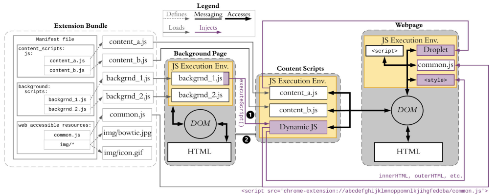

#CloakX

CloakX is a proof of concept extension cloaking system for chrome extensions. 
 
 
 
 ## Research paper
 
 We describe CloakX and our evaluation of it in the paper 
 
 **Everyone is Different: Client-side Diversification for Defending Against Extension Fingerprinting** [[PDF]](https://trickel.com/ev1diff)
 
 Erik Trickel, Oleksii Starov, Alexandros Kapravelos, Nick Nikiforakis, and Adam Doupé
 
 _In Proceedings of USENIX Security Symposium August 2019,_ 
 ``` tex
@inproceedings{ev1diff,
title = {Everyone is Different: Client-side Diversification for Defending Against Extension Fingerprinting},
author  = {Erik Trickel, Oleksii Starov, Alexandros Kapravelos, Nick Nikiforakis, and Adam Doup\'e},
year  = {2019},
booktitle = {28th USENIX Security Symposium}
} 
```
  
 ## Using CloakX
 
 The static analysis and modification of the extensions is performed by using `cloak.py` and providing a path to a directory of uncompressed extensions. 
 
 `cloakx/cloak.py extension_directory`
 
 The python script will process each extension performing static analysis on the droplets and renaming the war resources.
 
 The dynamic analysis is performed by running the following on the directory of an extension 
 
 `/onthefly_overwrite/patch_after_xhound.py extension`
 
 
 
 
 
 
 
 
 
 
  
 
 


 
